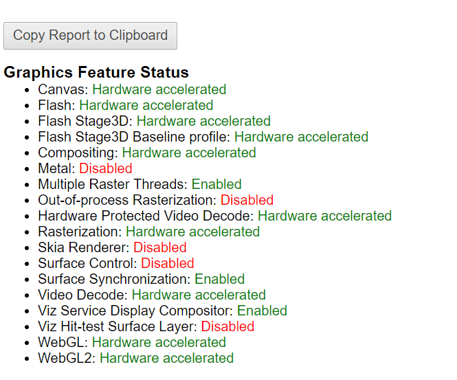
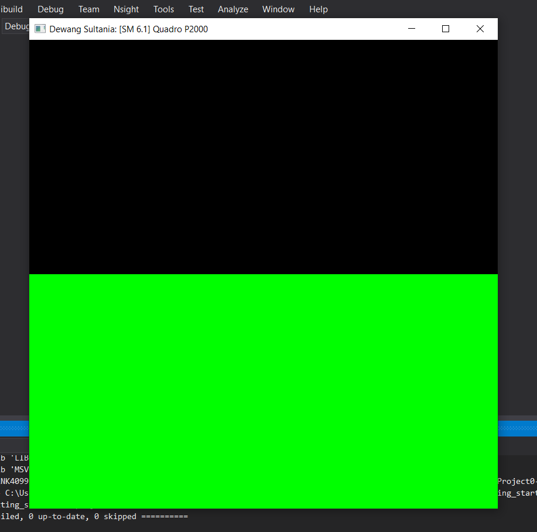
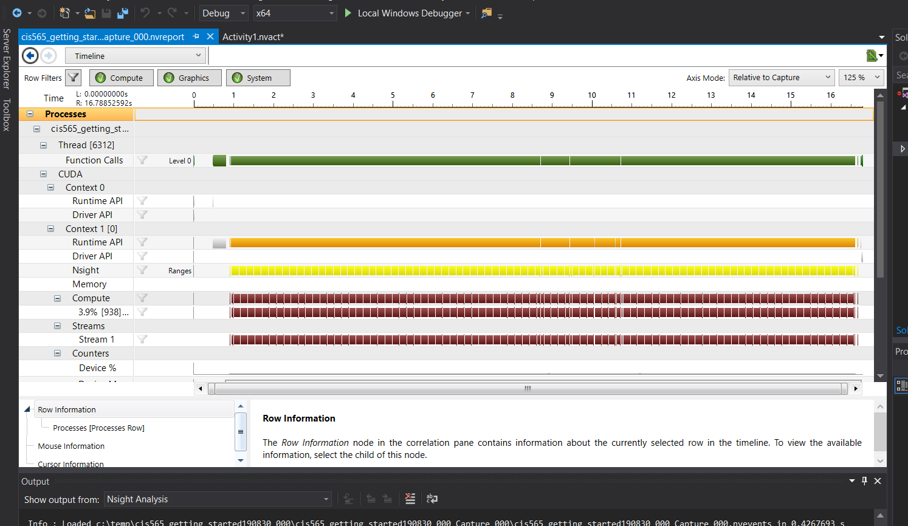
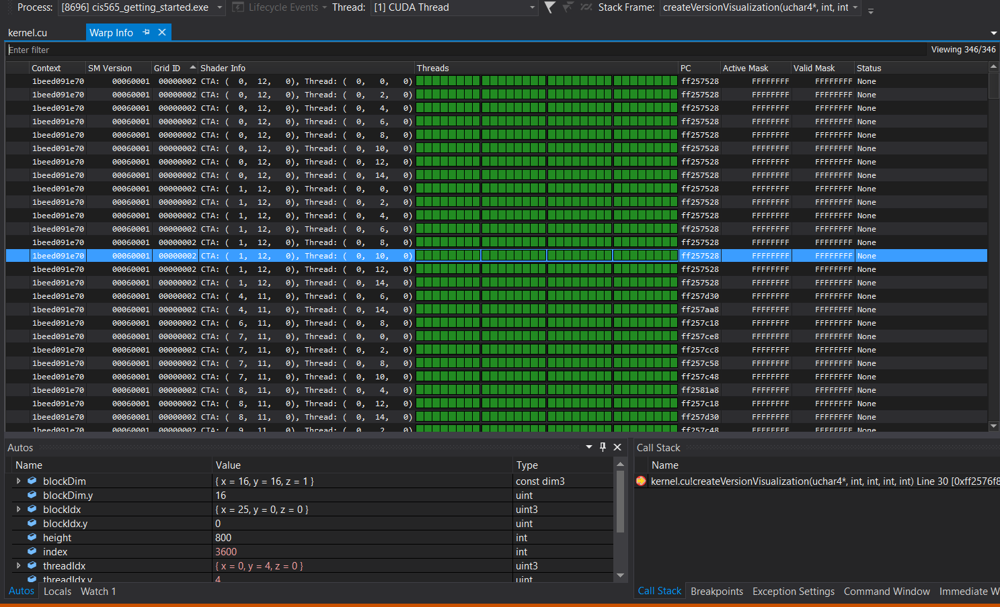

Project 0 Getting Started
====================

**University of Pennsylvania, CIS 565: GPU Programming and Architecture, Project 0**

* Dewang Sultania
  * [LinkedIn](https://www.linkedin.com/in/dewang-sultania)
* Tested on: Windows 10, Intel Xeon E-2176M @ 2.70GHz 16GB, Quadro P2000 4GB (Personal Computer)
* Cuda Compute Capability: 6.1

#### WebGL Chrome

#### CUDA Window

#### Timeline

#### Warp and Autos

